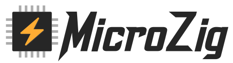

# 

> **NOTE:** This is in development; breaks in the API are bound to happen.

## What version of Zig to use

Zig 0.14.0

## Getting Started With MicroZig

### I Want To Use MicroZig

**IMPORTANT:** You may not have to clone the whole repository to get started.

MicroZig uses a monorepo architecture, but provides a lot of different packages. If you just want to get started, head over to [downloads.microzig.tech](https://downloads.microzig.tech/) and download an example for the chip family you desire. MicroZig's version listed here match the zig versions assoicated with them, so version 12.0 match zig 12.0. If you don't see the zig version here you will have to clone the repo to get started.

We support several chip families like the [RP2 family by RaspberryPi Foundation](https://www.raspberrypi.com/products/rp2040/), [STM32 by STMicroelectronics](https://www.st.com/content/st_com/en.html), and many others.

Unpack the example, and run `zig build` in the resulting example folder gives you `zig-out/firmware` which contains the resulting files.

Right now, you gotta figure out how to flash the MCU yourself, but as people say: Google is your friend. But you can also ask for help [on our Discord server](https://discord.gg/ShUWykk38X).

### I Want To Contribute To MicroZig

Please see the [project page](https://github.com/orgs/ZigEmbeddedGroup/projects/1/views/1), it’s used as a place to brainstorm and organize work in ZEG. There will be issues marked as good first issue or drafts for larger ideas that need scoping/breaking ground on.

More words on contribution and development on MicroZig are [further down below](#developing).

## Introduction

This repo contains the infrastructure for getting started in an embedded Zig project; it "gets you to main()". Specifically, it offers:

* a single easy-to-use builder function that:
  * generates your linker script
  * sets up packages and startup code
* generalized interfaces for common devices, such as UART.
* device drivers for interacting with external hardware
* an uncomplicated method to define xref:interrupts[interrupts]

## Design

For MicroZig internals please see the [Design Document](docs/design.md).

## Repository structure

* `build/` contains the build components of MicroZig.
* `core/` contains the shared components of MicroZig.
* `port/` contains all official board support package.
* `examples/` contains examples that can be used with the board support packages.
* `tools/` contains tooling to work *on* MicroZig itself, so deployment, testing, ...
* `design/` contains images and logos

## Versioning Scheme

MicroZig versions are tightly locked with Zig versions.

The general scheme is `${zig_version}-${commit}-${count}`, so the MicroZig versions will look really similar to
Zigs versions, but with our own commit abbreviations and counters.

As MicroZig sticks to tagged Zig releases, `${zig_version}` will show to which Zig version the MicroZig build is compatible.

Consider the version `0.11.0-abcdef-123` means that this MicroZig version has a commit starting with `abcdef`, which was the 123rd commit of the version that is compatible with Zig 0.11.0.

