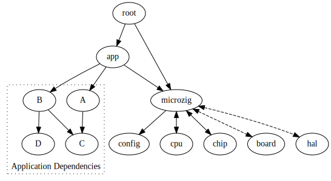

G MicroZig Design

## Dependency Tree

The build portion of MicroZig sets up a dependency graph like the following.



Your application lives in `app`; that's where `main()` resides. `root` contains
the entry point and will set up [zero-initialized data] and [uninitialized
data]. This is all encapsulated in an `EmbeddedExecutable` object. It has
methods to add dependencies acquired from the package manager.

The `microzig` module has different namespaces, some are static, but the nodes
you see in the diagram above are switched out according to your configured
hardware.

## Configurable Modules under `microzig`

The configurable modules, with the exception of `config`, are able to import
`microzig`. This exists so that one module may access another through
`microzig`. This allows us to have patterns like the `hal` grabbing the
frequency of an external crystal oscillator from `board`. Information stays
where it's relevant. Circular dependencies of declarations will result in a
compile error.

### `cpu`

This module models your specific CPU and is important for initializing memory.
Generally, you shouldn't need to define this yourself, it's likely that MicroZig
will have the definition for you.

Further research is needed for SOCs with multiple, heterogeneous CPUs. Likely it
means patching together multiple `EmbeddedExecutable`s.

### `chip`

This module is intended for generated code from
(Regz)[https://github.com/ZigEmbeddedGroup/microzig/tree/main/tools/regz]. You
can hand write this code if you like, but needs to be structured as follows:

```zig
pub const types = struct {
    // type definitions for peripherals here
};

pub const devices = struct {
    pub const chip_name = struct {
        // peripherals and interrupt table here ...
    };
};
```

This code generation has a `devices` namespace where your specific hardware will
reside. When defining a `Chip`, which is ultimately used in the creation of an
`EmbeddedExecutable`, the name must exactly match the name under the `devices`
namespace. It's okay if the name has white space, for that we can use `@""`
notation.

Let's say we had a device with the name `STM32F103`. We'd define our target as:

```zig
pub const stm32f103: microzig.Target = .{
    .dep = dep,
    .preferred_binary_format = .elf,
    .zig_target = .{
        .cpu_arch = .thumb,
        .cpu_model = .{ .explicit = &std.Target.arm.cpu.cortex_m3 },
        .os_tag = .freestanding,
        .abi = .eabi,
    },
    .chip = .{
        .name = "STM32F103RD",
        .register_definition = .{
            .zig = b.path("/path/to/file.zig"),
        },
        .memory_regions = &.{
            .{ .offset = 0x08000000, .length = 64 * 1024, .kind = .flash },
            .{ .offset = 0x20000000, .length = 20 * 1024, .kind = .ram },
        },
    },
    .hal = .{
        .root_source_file = b.path("/path/to/file.zig"),
    },
};
```

As discussed, the `target.chip.name` must match a namespace under `devices` in the `chip` source.

### `hal`

This module contains hand-written code for interacting with the chip.

TODO

### `board`

TODO

### `config`

TODO

## Static Namespaces under `microzig`

TODO

## Linkerscript Generation

TODO

## JSON register schema

TODO

## Interrupts

TODO
